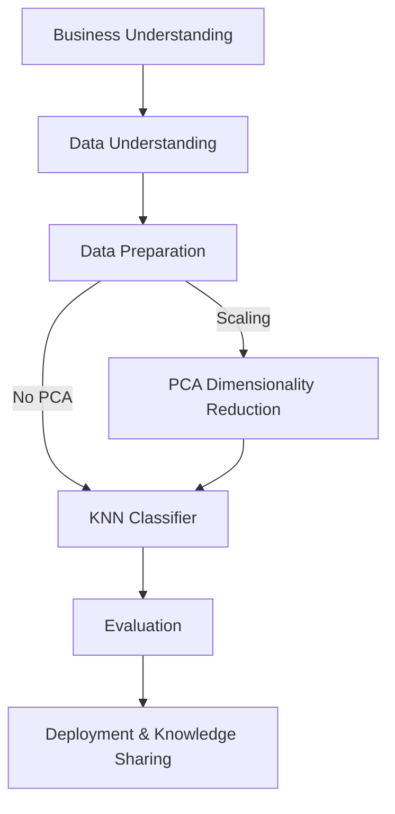

# 🩺 Diabetes Risk Classification with KNN  

## 📌 Problem Statement  
Diabetes is a major global health concern, and early detection reduces complications and costs. This project asks:  

**“Can we classify whether an individual has diabetes using k-nearest neighbors (KNN) based on lifestyle and demographic indicators from the CDC BRFSS survey?”**  

---

## 🎯 Overall Goal  
Build an interpretable, reproducible KNN-based pipeline for early diabetes detection using the BRFSS 2015 survey.  

Specifically:  
- ✅ Use large-scale self-reported indicators to predict diabetes.  
- ✅ Compare KNN models with and without PCA to study dimensionality reduction effects.  
- ✅ Identify which self-reported health factors are most predictive of diabetes.  

---

## 🌀 CRISP-DM Framework  

**1. Business Understanding**  
- Diabetes is underdiagnosed; early prediction can save lives.  
- Goal: Predict diabetes from BRFSS health indicators.  

**2. Data Understanding**  
- **BRFSS 2015:** ~250k rows of survey-based features (BMI, smoking, activity, blood pressure, cholesterol, demographics).  

**3. Data Preparation**  
- Standardize column names, drop duplicates, handle missingness.  
- Scale features for KNN/PCA.  

**4. Modeling**  
- KNN classifier with cross-validation; tune **k** to minimize misclassification.  
- Threshold tuning with `predict_proba`.  
- Apply **PCA** (retain 95% variance) and compare with non-PCA.  

**5. Evaluation**  
- Metrics: **Accuracy, Precision, Recall, F1 Score, ROC-AUC**.  
- Compare KNN with vs without PCA.  

**6. Deployment & Knowledge Sharing**  
- Repo with notebooks, scripts, and visualizations.  
- Outputs: PCA plots, ROC curves, confusion matrices.  

---

## 📊 Dataset  

**CDC BRFSS (2015)**  
- [Kaggle Dataset](https://www.kaggle.com/datasets/alexteboul/diabetes-health-indicators-dataset/data)  
- ~253,680 rows × 22 features  
- Target: `Diabetes_binary`  

---

## 🏗 Design & Methodology  

- **Preprocessing**  
  - Load BRFSS CSV.  
  - Standardize column names.  
  - Scale features for KNN & PCA.  

- **PCA Integration**  
  - Apply PCA to reduce dimensionality.  
  - Retain ≥95% variance.  
  - Visualize clusters in PCA space.  

- **Modeling**  
  - Baseline KNN.  
  - KNN + PCA reduced dataset.  

- **Evaluation**  
  - Accuracy, Recall, Precision, F1, ROC-AUC.  
  - Trade-offs between PCA vs non-PCA models.  

---

## 🎯 Expected Outcomes  

- **With PCA**  
  - Faster training.  
  - Reduced redundancy.  
  - Improved visualization.  

- **Without PCA**  
  - More interpretable, but slower.  

---

## 📈 Workflow Diagram  


---
## 📂 Project Structure  

```bash
brfss-diabetes-classification/
│
├── data/                # BRFSS dataset (CSV)
├── notebooks/           # Jupyter notebooks for EDA & experiments
├── src/                 # Python scripts (preprocessing, modeling, utils)
├── results/             # Plots, metrics, evaluation outputs
├── README.md            # Project documentation (this file)
└── requirements.txt     # Python dependencies
```

🚀 Next Steps

 - Preprocess BRFSS dataset  
 - Train/evaluate KNN models with cross-validation; tune distance metrics/weights  
 - Integrate PCA (95% variance) and compare against non-PCA  
 - Add Decision Trees, Random Forests, and KNN Regressor baselines  
 - Consider class-imbalance mitigation and permutation importance for interpretability  
