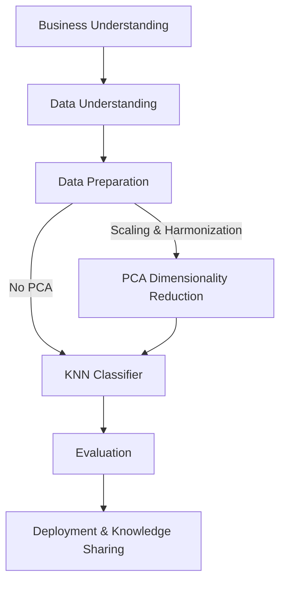

# 🩺 Diabetes Risk Classification with KNN  

## 📌 Problem Statement  
Diabetes is a major global health concern, with early detection being critical to prevent complications and reduce healthcare costs. This project explores the question:  

**“Can we classify whether an individual has diabetes using k-nearest neighbors (KNN) based on lifestyle, demographic, and biomarker features?”**  

Unlike typical projects that rely on a single dataset, this project **merges two complementary CDC datasets — BRFSS (Behavioral Risk Factor Surveillance System) and NHANES (National Health and Nutrition Examination Survey)** — to study whether combining survey-based and biomarker-based features improves diabetes classification.  

---

## 🎯 Overall Goal  
The goal of this project is to **develop an interpretable and robust machine learning framework for early diabetes detection**.  

Specifically, this project aims to:  
- ✅ Improve prediction by merging **survey-based indicators (BRFSS)** and **clinical biomarkers (NHANES)**.  
- ✅ Evaluate the effect of **self-reported vs measured data** on model accuracy.  
- ✅ Compare **KNN models with and without PCA** to study dimensionality reduction effects.  
- ✅ Provide **reproducible insights** into which health factors are most predictive of diabetes.  

---

## 🌀 CRISP-DM Framework  

**1. Business Understanding**  
- Diabetes is underdiagnosed; early prediction can save lives.  
- Goal: Predict diabetes from health indicators.  

**2. Data Understanding**  
- **BRFSS:** Survey-based, ~250k rows.  
- **NHANES:** Biomarker + survey data, ~10k participants.  
- Overlapping features: BMI, smoking, activity, BP, cholesterol, demographics.  

**3. Data Preparation**  
- Harmonize variables across datasets.  
- Convert continuous labs (BP, cholesterol) → binary flags.  
- Scale features for KNN/PCA.  
- Merge into ~263k unified dataset.  

**4. Modeling**  
- KNN classifier with cross-validation.  
- Tune **k** to minimize misclassification.  
- Threshold tuning with `predict_proba`.  
- Apply **PCA** (retain 95% variance).  
- Compare KNN with vs without PCA.  
- Extend to regression (KNN vs Linear Regression).  

**5. Evaluation**  
- Metrics: **Accuracy, Precision, Recall, F1 Score, ROC-AUC**.  
- Compare across: BRFSS only, NHANES only, merged, PCA dataset.  

**6. Deployment & Knowledge Sharing**  
- Repo with notebooks, scripts, and visualizations.  
- Outputs: PCA plots, ROC curves, confusion matrices.  

---

## 📊 Datasets  

**1. CDC BRFSS (2015)**  
- [Kaggle Dataset](https://www.kaggle.com/datasets/alexteboul/diabetes-health-indicators-dataset/data)  
- ~253,680 rows × 22 features  
- Target: `Diabetes_binary`  

**2. NHANES (2015–2016)**  
- [Official Dataset](https://wwwn.cdc.gov/nchs/nhanes/continuousnhanes/default.aspx?BeginYear=2015)  
- ~10,000 participants  
- Survey + biomarker data (BMI, BP, Cholesterol, Glucose, etc.)  
- Target: `Diabetes_binary` (from self-report + labs)  

---

## 🏗 Design & Methodology  

- **Preprocessing**  
  - Load BRFSS (CSV) & NHANES (.XPT).  
  - Standardize column names.  
  - Scale features for KNN & PCA.  

- **PCA Integration**  
  - Apply PCA to reduce dimensionality.  
  - Retain ≥95% variance.  
  - Visualize clusters in PCA space.  

- **Modeling**  
  - Baseline KNN.  
  - KNN + PCA reduced dataset.  
  - Regression comparison: KNN vs Linear Regression.  

- **Evaluation**  
  - Accuracy, Recall, Precision, F1, ROC-AUC.  
  - Trade-offs between PCA vs non-PCA models.  

---

## 🎯 Expected Outcomes  

- **With PCA**  
  - Faster training.  
  - Reduced redundancy.  
  - Improved visualization.  

- **Without PCA**  
  - More interpretable, but slower.  

- **Merged Dataset**  
  - Combines **scale (BRFSS)** + **precision (NHANES)** → strongest performance.  

- **Regression**  
  - Linear Regression = more interpretable.  
  - KNN Regression = more flexible for non-linear patterns.  

---

## 📈 Workflow Diagram  


---
## 📂 Project Structure  

```bash
brfss-nhanes-diabetes-classification/
│
├── data/                # Raw datasets (BRFSS CSV, NHANES .XPT)
├── notebooks/           # Jupyter notebooks for EDA & experiments
├── src/                 # Python scripts (preprocessing, modeling, utils)
├── results/             # Plots, metrics, evaluation outputs
├── README.md            # Project documentation (this file)
└── requirements.txt     # Python dependencies
```

🚀 Next Steps

 - Preprocess BRFSS & NHANES datasets
 - Align overlapping features
 - Train/evaluate KNN models with CV
 - Integrate PCA and compare
 - Extend to regression models
 - Document findings

